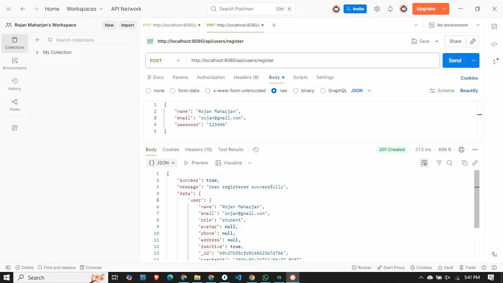

# RecipeNest Chef Portal — Authentication & Upload Backend

Student: Rojan Maharjan · ID: 2424808  
Course: CIS051‑2 (Web Development)  
Instructor: Ram Udgar Yadav, Senior Lecturer and IoT Coordinator, PCPS College  

This backend implements the Authentication and File Handling requirements for the RecipeNest Chef Portal. It provides secure user management, role-based access, and validated profile image uploads for chef profiles. It focuses on the assignment-mandated features (auth + upload) and serves as the backend component for RecipeNest.

## Objectives Alignment
- Develop a secure authentication system with password hashing and JWT.
- Implement user authorization and protected routes for role-based access.
- Configure and manage validated file uploads for profile images.
- Apply full‑stack practices with clean project structure and documentation.

## Key Features
- Authentication: register and login issuing JWT.
- Authorization: role-based guards on protected endpoints (default roles present: `student`, `teacher`, `admin`; can be mapped to `chef`/`admin` in RecipeNest).
- Password security: bcrypt hashing with per‑save salt.
- Profile management: read/update profile fields and change password.
- Image uploads: validated JPEG/PNG, size‑limited, stored and served statically.
- Persistence: MongoDB via Mongoose, input validation at model/service layers.
- CORS: configured for an external frontend origin.

## Tech Stack
- Runtime: Node.js
- Framework: Express.js
- Database: MongoDB (Mongoose)
- Auth: JWT, bcrypt
- Uploads: multer
- Utility: dotenv, cors

## Requirements
- Node.js 18+
- MongoDB running locally or in the cloud
- Environment variables in `.env`

### Environment Variables
```
PORT=8080
DB_URL=mongodb://localhost:27017/cmsbackend
JWT_SECRET=replace-with-a-strong-secret
JWT_EXPIRES_IN=1d
CLIENT_URL=http://localhost:5173
```

## Quick Start
```bash
npm install
npm run dev   # development with nodemon
# or
npm run start # production
```
Server runs on `http://localhost:8080` by default.

## API Overview (RecipeNest)

### Auth
- POST `/api/users/register`
  - Body: `{ "name": "Rojan Maharjan", "email": "rojan@gmail.com", "password": "123456", }`
  - Returns: `user`, `token`
  - During viva/presentation, demonstrate this call in Postman with a successful response.
- POST `/api/users/login`
  - Body: `{ "email": "rojan@gmail.com", "password": "123456" }`
  - Returns: `user`, `token`

Include the token in protected requests:
```
Authorization: Bearer <token>
```

### Profile
- GET `/api/users/profile`
- PUT `/api/users/profile`
  - Body: any of `{ "name": "...", "phone": "...", "address": "...", "avatar": "/uploads/avatars/..." }`
- POST `/api/users/change-password`
  - Body: `{ "currentPassword": "...", "newPassword": "..." }`

### Profile Avatar Upload
- POST `/api/users/profile/avatar`
  - Form-Data: `avatar` or `Avatar` (file)
  - Accepts: JPEG/PNG
  - Max size: 2MB
  - Response includes `avatarUrl` and updated `user`

Uploaded files are stored in `uploads/avatars` and served under `/uploads/...`.

## Test Upload in Postman
- Step 1: Register
  - Request: `POST http://localhost:8080/api/users/register`
  - Body (JSON): `{ "name": "Rojan Maharjan", "email": "rojan@gmail.com", "password": "123456" }`
  - On success, take note of the response and the new user.
- Step 2: Login
  - Request: `POST http://localhost:8080/api/users/login`
  - Body (JSON): `{ "email": "rojan@gmail.com", "password": "123456" }`
  - Copy the `token` from the response.
- Step 3: Upload Avatar
  - Request: `POST http://localhost:8080/api/users/profile/avatar`
  - Authorization: `Bearer <token>` in the `Authorization` header
  - Body: choose `form-data`
    - Key: `avatar` or `Avatar` (Type: File), select a local `.png` or `.jpg` image ≤ 2MB
  - Send the request; the response returns the updated `user` and an `avatarUrl`.
- Step 4: View Image
  - Open the `avatarUrl` in a browser. Files are served from `/uploads/avatars/...`.
- Validation:
  - Invalid type (e.g., PDF) returns `400` with message: “Invalid file type. Only JPEG and PNG are allowed.”
  - Oversized file (> 2MB) returns `413` with message: “File too large. Max size is 2MB.”

## Admin
- GET `/api/users` (paginated, active users by default)
 - GET `/api/users/:id`
 - DELETE `/api/users/:id` (soft-deactivate)

### Notes on Scope
- Recipe content CRUD and multi-image recipe upload (hero + step images + final result) are described in the report and planned as next phases. This backend currently implements profile avatar upload as the assignment’s required file handling milestone.

## Example Requests
Register:
```bash
curl -X POST http://localhost:8080/api/users/register \
  -H "Content-Type: application/json" \
  -d '{"name":"Rojan Maharjan","email":"rojan@gmail.com","password":"123456"}'
```

Upload avatar:
```bash
curl -X POST http://localhost:8080/api/users/profile/avatar \
  -H "Authorization: Bearer <token>" \
  -F "avatar=@/path/to/image.png"
```

## Project Structure
```
cms_backend/
├─ server.js
├─ src/
│  ├─ app.js
│  ├─ config/
│  │  ├─ config.js
│  │  └─ database.js
│  ├─ controllers/
│  │  └─ user.controller.js
│  ├─ middleware/
│  │  ├─ auth.middleware.js
│  │  └─ upload.middleware.js
│  ├─ models/
│  │  └─ user.models.js
│  ├─ routes/
│  │  ├─ user.routes.js
│  │  └─ course.routes.js
│  └─ services/
│     └─ user.service.js
└─ uploads/
   └─ avatars/
```

## Notes
- Use a strong `JWT_SECRET` and rotate tokens regularly.
- `uploads/` is ignored by Git and served statically by the API.
- Error responses follow a consistent JSON shape with `success`, `message`, and status code.
- Screenshots are provided under `./screenshots` and embedded below.

## Screenshots
- Register — Postman:
  
- Login — Postman:
  .webp)
- Avatar Upload — Postman:
  .webp)
